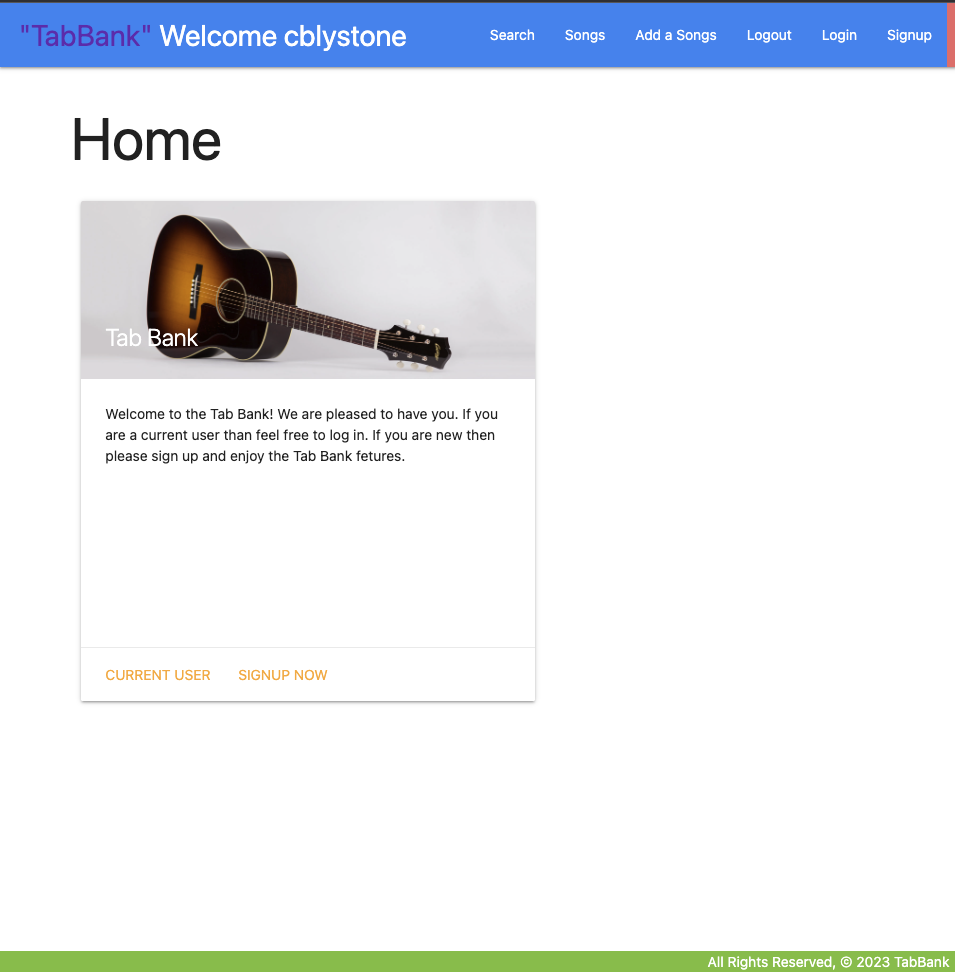
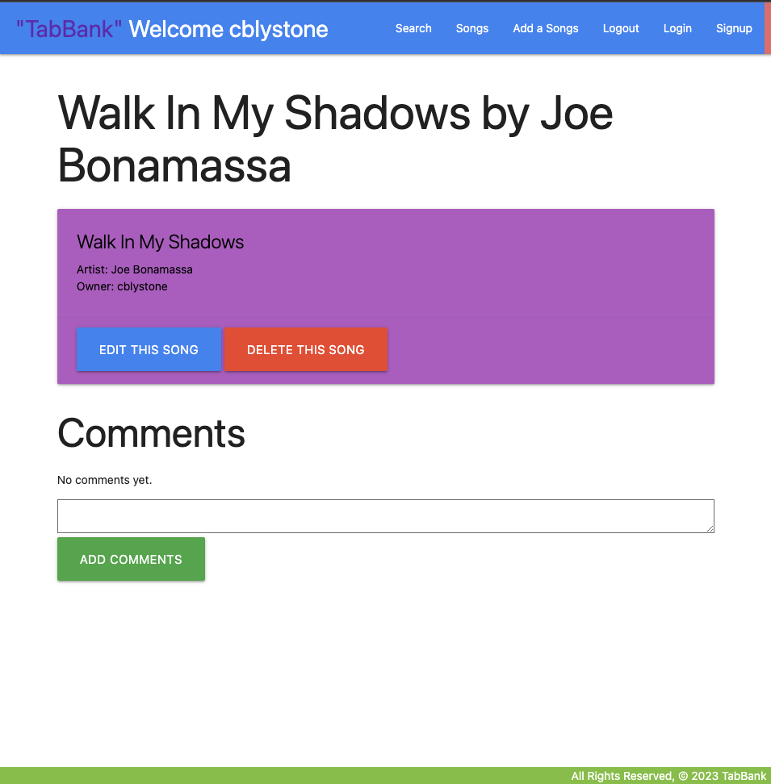
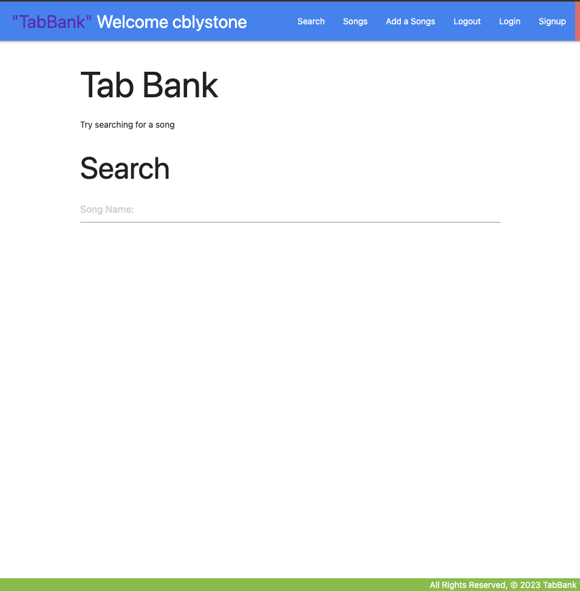
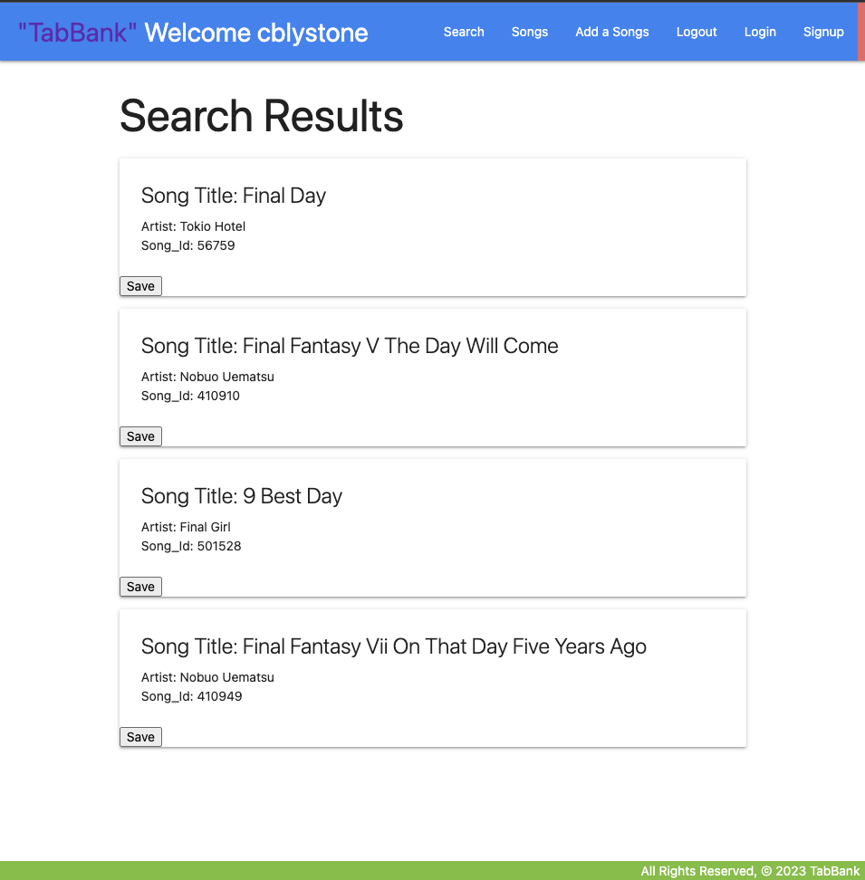
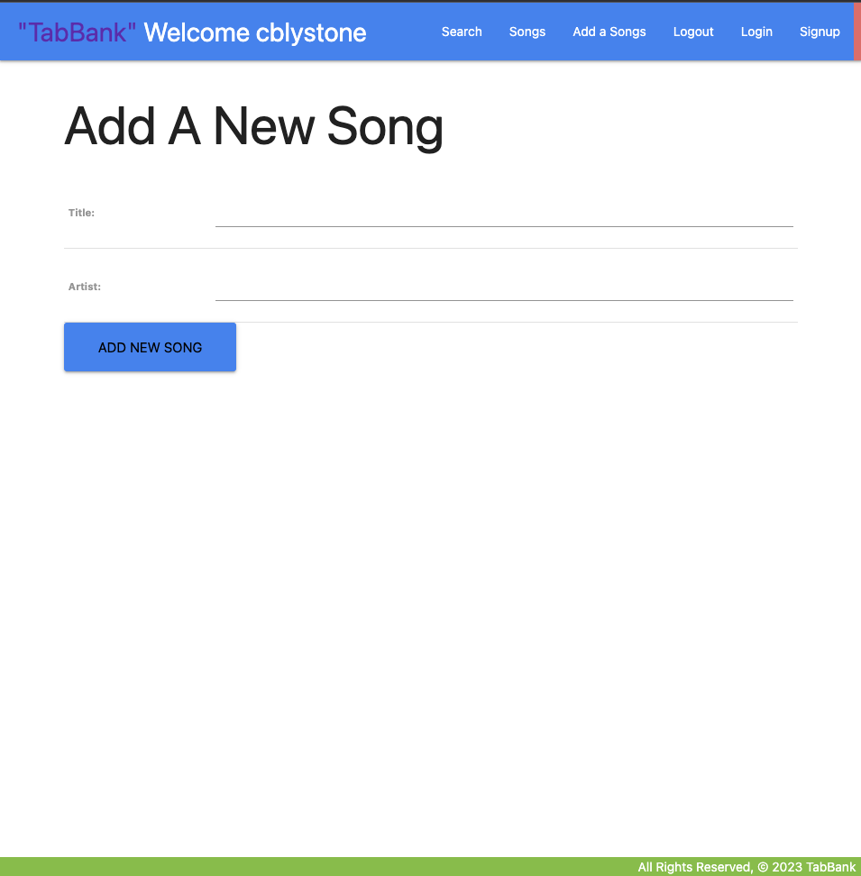

# TabBank
## TabBank is a Django-based web application that allows users to store and organize guitar tabs and related information. It provides a user-friendly interface for managing tabs, searching for new tabs, and collaborating with others.

### Installation
* Copy code
* git clone <https://github.com/cblystone67/TabBank>
* pip install -r requirements.txt
* python manage.py migrate
* python manage.py runserver

## Features
* The application has the the ability to login and logout users.
* The ability to allow a user his/hers own access to the website.
* The ability to search and save songs form a dedicated API
* The ability to save comments to each individual song.

## Usage
* The user will be allowed full CRUD ability.
* The user can create new new songs
* The user can view those songs and the details of those songs
* The user can update and edit those songs and comments
* The user can delete songs and comments.

* When the user lands on the page they are met with the Home Page.

This page allows the user to either signup and create a new account or sign in if they are a current user.
On this page the user can either use the navigation bar to sign in or up or they can utilize the links on the welcome card.
After siging in they are awarded their own page welcoming them: 

Upon landing on this page they now can take advantage of the application and start utilizing the features.
- First if they are a current user their page will load with the current songs they have saved.
- Second they then have several options: 
* first is to click on the current song which will give them the details of the song: 

 - This page gives them the details of the song:
 * They can edit the song information:
 * Delete the song:
 * Create a comment: Which will appear on the page with the information entered.
 * They then can either edit that comment or delete that comment as they see fit.

## The Search
- As the user they can decide to search for an individual song from an API called Songsterr.
* By entering either the Artist Name or Song title they will be returned with a list of songs.

- Upon the user submitting the search they are then given the results page:

- Now the user if finding a song they choose can then save it to their user account:

-Now the user also has the ability if they didn't find the song they so desired they can just add it to the list of songs by using the Add a Song feature:

## API Integration
* API used: <https://publicapis.io/songsterr-music-api>

## Icebox Challenges
* First would be allowing the tab of the songs the user selected to be viewed.
* Second would be to add functionality so that the user could either be redirected to one of the many learning sites or have them render dynamically on the page in a static or embeded video
* Third would be to set up the functionality so a user could store their own music and song lyrics.  
- Creating for the user a place where they can create and store their ideas and visions.

# Deployment
* Deployed to Heroku link below:
<https://dry-tundra-23500.herokuapp.com/>

