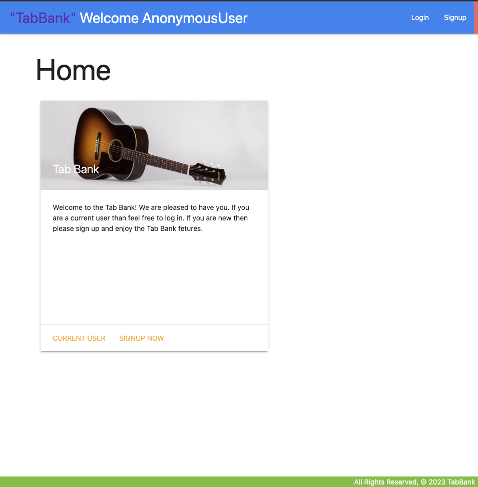

# TabBank
## TabBank is a Django-based web application that allows users to store and organize guitar tabs and related information. It provides a user-friendly interface for managing tabs, searching for new tabs, and collaborating with others.

### Installation
* Copy code
* git clone <https://github.com/cblystone67/TabBank>
* pip install -r requirements.txt
* python manage.py migrate
* python manage.py runserver

## Features
* The application has the the ability to login and logout users.
* The ability to allow a user his/hers own access to the website.
* The ability to search and save songs form a dedicated API
* The ability to save comments to each individual song.

## Usage
* The user will be allowed full CRUD ability.
* The user can create new new songs
* The user can view those songs and the details of those songs
* The user can update and edit those songs and comments
* The user can delete songs and comments.

## API Integration
* API used: <https://publicapis.io/songsterr-music-api>
Icebox Challenges

